# Cognitive Fractal — Architecture Diagram

## Fractal Class Hierarchy

```mermaid
classDiagram
    direction TB

    class Fractal {
        +int dim
        +ndarray prototype
        +ndarray variance
        +ndarray prediction_weights
        +float learning_rate
        +float variance_rate
        +Metrics metrics
        +Memory memory
        +str id
        +list children
        +process(Signal) → Signal, float
        +learn(Feedback) → float
        +compress() → dict
    }

    class FunctionFractal {
        +str func_name
        +ndarray coefficients
        +ndarray _signature
        +int predict_horizon
        +float _y_scale
        dim = n_coeffs
        prototype = EMA of coefficients
        variance = coefficient stability
        +evaluate(x) → y
        +fit(x, y) → void
        +symbolic_repr() → str
        +seed_from(other) → void
        +compute_signature() → ndarray
    }

    class ConstantFractal {
        n_coeffs = 1
        «c₀»
        +evaluate: y = c₀
    }

    class LinearFractal {
        n_coeffs = 2
        «m, b»
        +evaluate: y = mx + b
    }

    class QuadraticFractal {
        n_coeffs = 3
        «a, b, c»
        +evaluate: y = ax² + bx + c
    }

    class PolynomialFractal {
        n_coeffs = degree + 1
        «a₀…aₙ»
        +evaluate: y = Σaᵢxⁱ
    }

    class SinFractal {
        n_coeffs = 4
        «A, ω, φ, B»
        +evaluate: y = A·sin(ωx + φ) + B
        +fit: FFT-based
    }

    class CosFractal {
        n_coeffs = 4
        «A, ω, φ, B»
        +evaluate: y = A·cos(ωx + φ) + B
        +fit: FFT-based
    }

    class GradientSinFractal {
        +fit: FFT init then gradient descent
        warm-starts from current coeffs
    }

    class GradientCosFractal {
        +fit: FFT init then gradient descent
        warm-starts from current coeffs
    }

    class ExponentialFractal {
        n_coeffs = 3
        «A, b, C»
        +evaluate: y = A·eᵇˣ + C
        overflow protection
    }

    class LogFractal {
        n_coeffs = 4
        «A, b, c, D»
        +evaluate: y = A·log(bx + c) + D
        domain safety
    }

    class ComposedFunctionFractal {
        +str mode: add | multiply | subtract | divide
        +FunctionFractal outer
        +FunctionFractal inner
        +evaluate: outer ⊕ inner
        residual-based composition
    }

    class NestedComposedFractal {
        +FunctionFractal outer
        +FunctionFractal inner
        +evaluate: outer(inner(x))
        function-of-function nesting
    }

    class InvertedCompositionFractal {
        +BaseFunction outer_func
        +list chain
        +int degree
        +evaluate: F(G(…poly(x)))
        backward inversion fitting
        branch enumeration
    }

    class MixedInnerFractal {
        +BaseFunction outer_func
        +BaseFunction inner_func
        +ndarray inner_coeffs
        +evaluate: F(poly + G(inner_poly))
        combinatorial unwrap
        QR validation
    }

    Fractal <|-- FunctionFractal : inherits\nprototype + variance\nnow alive
    FunctionFractal <|-- ConstantFractal
    FunctionFractal <|-- LinearFractal
    FunctionFractal <|-- QuadraticFractal
    FunctionFractal <|-- PolynomialFractal
    FunctionFractal <|-- SinFractal
    FunctionFractal <|-- CosFractal
    SinFractal <|-- GradientSinFractal : extends with\ngradient descent
    CosFractal <|-- GradientCosFractal : extends with\ngradient descent
    FunctionFractal <|-- ExponentialFractal
    FunctionFractal <|-- LogFractal
    FunctionFractal <|-- ComposedFunctionFractal
    FunctionFractal <|-- NestedComposedFractal
    FunctionFractal <|-- InvertedCompositionFractal
    FunctionFractal <|-- MixedInnerFractal
    ComposedFunctionFractal o-- FunctionFractal : outer + inner\nchildren
    NestedComposedFractal o-- FunctionFractal : outer(inner(x))
```

## Layer Breakdown

### Layer 1 — Base Fractal
The online learning core with prototype, variance, prediction_weights, and the process()/learn() cycle.

### Layer 2 — FunctionFractal
The bridge layer. `dim=n_coeffs` so prototype and variance are alive — tracking coefficient EMA and stability. Batch `fit()` handles discovery, inherited state handles confidence.

### Layer 3 — Leaf Fractals (12 types)
- **Polynomials:** Constant (1 coeff), Linear (2), Quadratic (3), Polynomial (n+1)
- **Trigonometric:** Sin/Cos (4 coeffs each, FFT-based fit) → GradientSin/GradientCos (warm-start gradient descent)
- **Transcendental:** Exponential (3 coeffs, overflow-safe), Log (4 coeffs, domain-safe)

### Layer 4 — Composition Fractals (4 types)
- **ComposedFunctionFractal** — arithmetic combination: `outer ⊕ inner` (add/multiply/subtract/divide)
- **NestedComposedFractal** — function nesting: `outer(inner(x))`
- **InvertedCompositionFractal** — chain fitting via backward inversion: `F(G(…poly(x)))` with branch enumeration
- **MixedInnerFractal** — composite inner: `F(poly + G(inner_poly))` with combinatorial unwrap + QR validation
